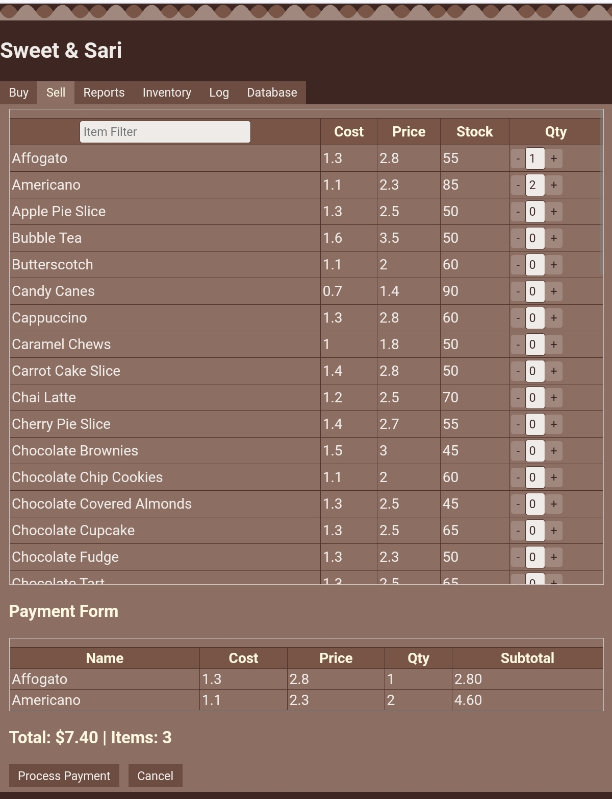

## Demo

## Purpose
Sweet and Sari is a Retail Management System (RMS) for a school project which includes inventory management, point of sale and reports. It is written in plain JavaScript and can run offline from the Android file manager in the Chrome browser

## Installation
- Download [sweetandsari.html](https://raw.githubusercontent.com/bacionejs/sweetandsari/main/sweetandsari.html)
- Open your file manager
- Tap `sweetandsari.html` to launch in Chrome

## Optional
- Close the `sweetandsari.html` tab if it is running.
- Download [fakedata.html](https://raw.githubusercontent.com/bacionejs/sweetandsari/main/fakedata.html)
- Open your file manager
- Tap `fakedata.html` to launch in Chrome to generate fake data.
- Reopen `sweetandsari.html`

## Features
- **Purchases**: Add, Update, Buy    
- **Sales**: Cart and Sales form
- **Reports**: Transactions, Items, Summary, Yearly, Monthly, Daily
- **Filters**: Show results as you type
- **Sort**: For low stock

## Limitations
- **Data**: Data will be deleted if you delete browsing data.
